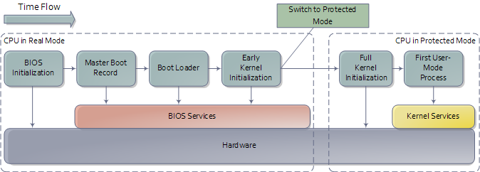
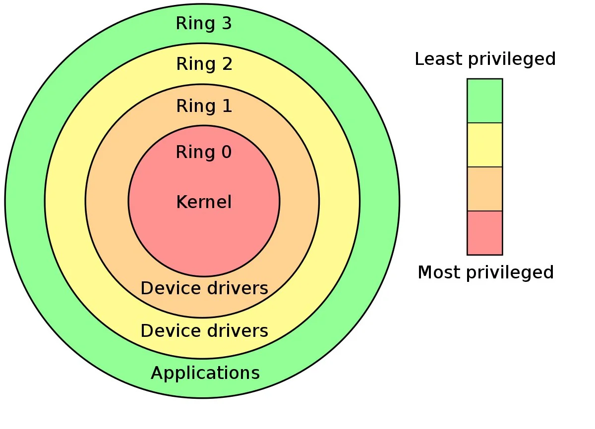
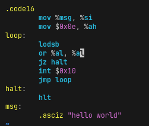
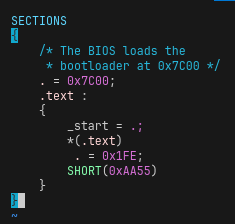
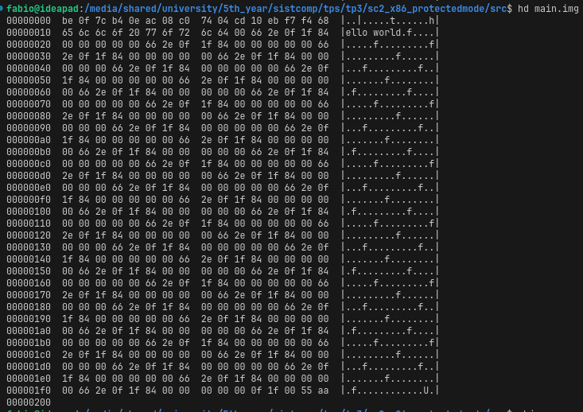
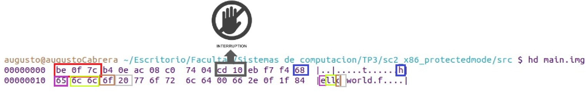
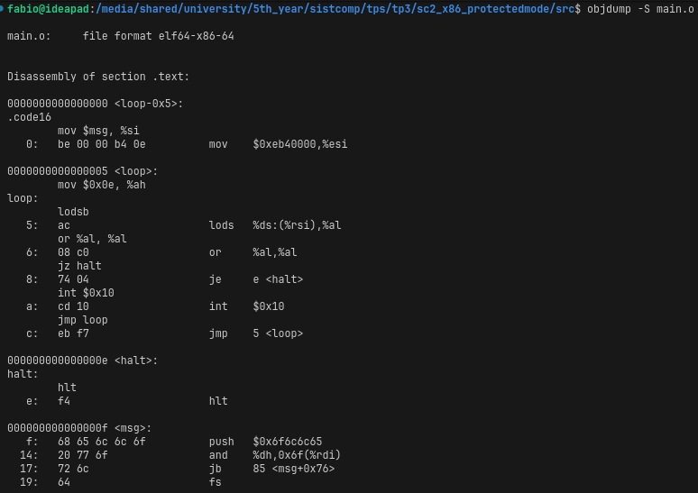
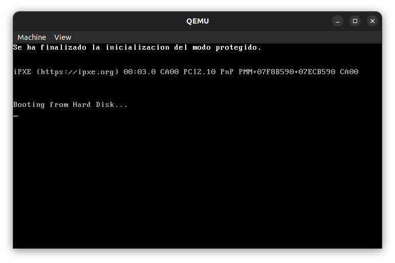

  

***TRABAJO PRACTICO 3***

**Titulo:** Real mode vs protected mode

**Asignatura:** Sistemas de Computación

**Integrantes:**
   - Cabrera, Augusto Gabriel 
   - Moroz, Esteban Mauricio 
   - Britez, Fabio
   - Gonzalez, Bruno

**Fecha:** 1/5/2024
   

---------------

  

# Real mode vs protected mode

Los procesadores x86 mantienen compatibilidad con sus antecesores y para agregar nuevas funcionalidades deben ir “evolucionando” en el tiempo durante el proceso de arranque. Todos los CPUs x86 comienzan en modo real en el momento de carga (boot time) para asegurar compatibilidad hacia atrás (Backward compatibility), en cuanto se los energiza se comportan  de manera muy primitiva, luego mediante comandos se los hace evolucionar hasta poder obtener la máxima cantidad de prestaciones posibles.
El ***modo protegido*** es un modo operacional de los CPUs compatibles x86 de la serie 80286 y posteriores. Este modo es el primer salto evolutivo de los x86. El modo protegido tiene un número de nuevas características diseñadas para mejorar la multitarea y la estabilidad del sistema, tales como la protección de memoria, y soporte de hardware para memoria virtual como también la conmutación de tareas.

  

## UEFI & Coreboot
- ¿Qué es la ***UEFI***? ¿Cómo se puede usar?
    - UEFI (Interfaz de Firmware Extensible Unificada) es un estándar de firmware que ha reemplazado en gran medida al antiguo BIOS (Sistema Básico de Entrada/Salida) en las computadoras modernas. Con respecto al tradicional BIOS, UEFI ofrece una serie de ventajas, como:
        - La BIOS usaba MBR, que estaba limitado a entradas de 32 bits y se limitaba a 4 particiones físicas en total. UEFI usa GPT que usa entradas de 64 bits, que se traduce en que cada una puede tener un máximo de 2 TB de capacidad. 
        - Soporte para arranque seguro (Secure Boot), que ayuda a prevenir la ejecución de malware durante el proceso de arranque.
        - Velocidad de arranque acelerada. En UEFI los módulos y controladores se cargan en paralelo, mientras que en BIOS se cargan secuencialmente. 
        - Soporte para interfaces gráficas. 

    - Para acceder a la UEFI se debe verificar cuál tecla ha sido asignada a nuestro sistema para entrar a modo UEFI, y presionarla durante el proceso de ***Power On Self Test*** previo al inicio del sistema operativo.

- Estas son algunas de las funciones de la UEFI a la que se podría llamar.

|     |   |      |      |     |    |      |    |   |      |
|------|------|------|------|------|-----|--------|--------|--------|--------|
| alias    | attrib  | bcfg     | cd     | cls    | comp   | cp     | date   | dblk   | dh     |
| dmpstore | echo    | edd30    | edddebug | edit  | err    | guid   | help   | load   | ls     |
| map      | mem     | memmap   | mkdir  | mm     | mode   | mount  | pause  | pci    | reset  |
| rm       | set     | stall    | time   | type   | unload | ver    | vol    |        |        |

Estos comandos estan relacionados al booteo desde una partición particular, otros relacionados a la obtención y modificación de información de las particiones, otros para manejar dispositivos y drivers, y muchas otras funcionalidades.  

- **Vulnerabilidades de UEFI que puedan ser explotados**.
   
ESET informó a Lenovo sobre todas las vulnerabilidades descubiertas el 11 de octubre de 2021. Se asignaron las siguientes CVE:
 * CVE-2021-3970: Lectura/escritura arbitraria de SMM.
    * CVE-2021-3971: Afecta a drivers de firmware para UEFI.
    * CVE-2021-3972: Permite modificar la configuración de arranque seguro.

El atacante puede desplegar y ejecutar con éxito implantes en flash SPI o ESP en los dispositivos afectado

- ¿Qué es el ***Converged Security and Management Engine*** *(CSME)*?

El ***Converged Security and Management Engine*** (CSME) de Intel es un controlador de seguridad y administración basado en hardware que está aislado de la CPU (Unidad Central de Procesamiento). CSME de Intel es la raíz de confianza del sistema para los componentes de Intel (y opcionalmente para un fabricante de equipos originales (OEM) si decide usarlo). CSME está compuesto por una extensión de hardware de administración convergente y un motor de seguridad convergente.
Se pueden encontrar más detalles en el whitepaper de Intel sobre el CSME [aquí](https://www.intel.com/content/dam/www/public/us/en/security-advisory/documents/intel-csme-security-white-paper.pdf).

- ¿Qué es la ***Intel Management Engine BIOS Extension*** *(Intel MEBx)*?
    - La MEBx es la predecesora del CSME. Su propósito era el mismo, pero es una versión más antigua y con menos funcionalidades.

  

 

- ¿Qué es el **coreboot**?

   Coreboot, anteriormente conocido como LinuxBIOS, es un proyecto de software destinado a reemplazar el firmware propietario (BIOS o UEFI) que se encuentra en la mayoría de los ordenadores con un firmware ligero diseñado para realizar sólo el número mínimo de tareas necesarias para cargar y ejecutar un sistema operativo moderno de 32 o 64 bits. Coreboot es respaldado por la Free Software Foundation (FSF). Coreboot se puede encontrar en [GitHub](https://github.com/coreboot/coreboot).

- ¿Qué productos incorporan el coreboot?

  - Protectli: Viene con el firmware Dasharo, mantenido por 3mdeb. Soporta numerosos sistemas operativos populares como distribuciones Linux, FreeBSD y Windows, incluyendo Debian, Ubuntu, OPNsense, pfSense, ProxMox VE, VMware ESXi, Windows 10 y 11, entre otros.
  - NovaCustom: Portátiles configurables con firmware basado en coreboot Dasharo, mantenido por 3mdeb. Ofrece compatibilidad total con GNU/Linux y Windows. Garantiza actualizaciones de seguridad a través de fwupd durante cinco años, y cuenta con características de seguridad importantes como arranque medido, arranque verificado, integración TPM y Arranque Seguro UEFI.

  - Dispositivos Chrome OS de Google: Incluyen OnHub y la tableta Pixel C, ambos con coreboot.

  - Minifree Ltd: Ofrece hardware preinstalado con la distribución Libreboot de coreboot.

  - Technoethical: Basados en la UE y EE. UU., envían a todo el mundo equipos con la distribución Libreboot de coreboot.
  - Purism: Fabrica portátiles enfocados en seguridad diseñados para trabajar con software libre y de código abierto. Son los únicos portátiles de alto rendimiento en el mercado específicamente diseñados para emparejar tecnologías recientes con coreboot y un Intel Management Engine neutralizado.

  - Star Labs: Ofrece una gama de portátiles diseñados y construidos específicamente para Linux con firmware coreboot. Utilizan Tianocore como carga útil e incluyen una opción de NVRAM para desactivar el Intel Management Engine.

- Las ventajas de utilizar Coreboot incluyen:

***Libertad y Transparencia*** : Coreboot es completamente de código abierto, lo que significa que se puede examinar, modificar y distribuir el código según tus necesidades.

***Arranque Rápido***: Coreboot está diseñado para un inicio rápido y eficiente del sistema, al ser un firmware ligero y minimalista.

***Compatibilidad con Hardware Variado***: Coreboot es compatible con una variedad de plataformas y arquitecturas, lo que lo convierte en una opción versátil para una amplia gama de hardware.

***Seguridad y Privacidad***: Coreboot ofrece una mayor seguridad y privacidad en comparación con los firmwares propietarios, ya que se puede auditar y verificar el código fuente.

***Modo de 32 bits***: Una notable característica única de coreboot es que la versión x86 corre en modo de 32 bits después de ejecutar solamente dieciséis instrucciones (casi todos los otros BIOS de x86 corren exclusivamente en modo de 16 bits)

## Linker
- ¿Qué es y qué hace un ***linker***?
    - El linker es un programa que toma uno o varios ficheros de tipo *objeto* (`.o`, `.obj`) generados a partir de un compilador y los combina en un único archivo ejecutable en forma binaria que englobará las instrucciones que debe ejecutar el procesador.
- ¿Qué es la dirección que aparece en el script del linker?
    - La dirección de memoria `0x7c00` indica una posición de memoria absoluta a partir de la cual se buscarán 512 bytes —correspondientes al Master Boot Record (MBR)—, especificando las instrucciones de arranque del sistema operativo y la tabla de particiones del dispositivo de almacenamiento.
- ¿Por qué es necesaria esta dirección?

 Esta dirección de memoria proviene de la primera generación de chips 8088 de Intel. Para mantener compatibilidad, los CPUs subsiguientes han mantenido la utilización de esta dirección para cargar el MBR.
    
Cuando se utilizaban estos chips, el sistema operativo era 86-DOS. Este OS necesitaba un mínimo de 32KB de memoria, lo cual representamos en el rango hexadecimal `0x0000 — 0x7fff`.

El chip 8088 ocupa desde `0x0000` hasta `0x03ff` para almacenar handlers de interrupciones, por lo que el rango de memoria utilizable que resta es `0x0400 — 0x7fff`.

Para dejar al OS la mayor cantidad de memoria contigua para utilizar, se decidió poner al MBR tan "alejado" como se pueda. Para esto, sabiendo que el MBR ocupa 512 bytes (`0x200`) y que se necesitan 512 bytes adicionales para información generada por el MBR, se eligió la posición del MBR 1024 bytes antes del límite de memoria. De esta forma: `0x7fff - 0x200 - 0x200 + 1 = 0x7c00`.

  

 
  

  

  

 
 

Codigo utilizado por el enlazador (como el GNU Linker) durante el proceso de compilación para determinar cómo organizar y colocar las secciones en la memoria.

#### Explicación:

- `. = 0x7C00;`: Establece el punto actual de enlace (la dirección de memoria) en `0x7C00`. Esto indica al enlazador dónde comenzará a colocar el código en la memoria.
- `_start = .;`: Define un símbolo llamado `_start` que apunta al inicio de la sección `.text`. Este símbolo se utiliza comúnmente como el punto de entrada del programa.
- `*(.text)`: Indica al enlazador que incluya todas las secciones de código fuente (`.text`) en esta sección. Esto significa que todas las funciones y código del programa se colocarán en esta sección.
- `.= 0x1FE;`: Establece el punto de enlace actual en la dirección `0x1FE`. Esto es comúnmente usado en el contexto de archivos de arranque de disco para asegurar que el programa tenga exactamente 512 bytes de tamaño, donde `0x1FE` es la posición del byte de firma de arranque (`0xAA55`).
- `SHORT(0xAA55)`: Este es un comando específico del enlazador que coloca el valor `0xAA55` en los últimos dos bytes del archivo. Esta es la firma de arranque requerida por la especificación del sector de arranque del disco. Indica que el sector es un sector de arranque válido.
 
 

  

  

 
- Compare la salida de `objdump` con `hd` y verifique dónde fue colocado el programa dentro de la imagen.

- Primero, vemos el output del comando `hd`:\
 

  

  

 

  

  

### Explicación:

- El código en hexadecimal que comienza con `be 0f 7c` es parte del código de arranque que carga el sector de arranque del disco en memoria y ejecuta el código que sigue después de él. 

- `cd` es una abreviatura de la instrucción `INT` (interrupción). La instrucción `INT` se utiliza para generar una interrupción de software en la CPU.

- En particular, `cd 10` es una interrupción que se usa comúnmente en programación de bajo nivel para realizar operaciones de E/S (entrada/salida) en el hardware, especialmente para la salida de texto en modo de video.

- La secuencia `68` después de `cd 10` corresponde al código ASCII de la letra 'h', que es parte de la cadena "hello world" que se está mostrando en el código.

- La instrucción `cd 10` seguida de `68` estaría relacionada con la salida del primer carácter 'h' en la cadena "hello world".

Ahora, el output del comando `objdump`:\
 

  

   

    - Analizando línea a línea, podemos observar que el programa en la imagen esta cargado desde la posición `0x00000000` en los bytes correspondientes al MBR.

 
- ¿Para qué se utiliza la opción `--oformat binary` en el linker?
    - La opción `--oformat` se utiliza para especificar el formato del archivo objeto resultante. En este caso, especificamos que luego del linking, el archivo generado será un archivo binario.

## Protected mode

`src/protected_mode/activate_protected_mode.S` Este código está destinado a iniciar el modo protegido en arquitecturas x86. Es una implementación básica de inicialización del modo protegido y una función de impresión en pantalla para entornos de desarrollo de sistemas operativos o bajo nivel. A continuación se adjuntan imágenes de la ejecución del mismo, con el emulador QEMU.

 

  

   

 ***Nota: Por alguna razón desconocida, el programa entra en un bucle infinito del cual no hemos encontrado la forma de corregirlo***. 
 

 <h4>   ¿Cómo sería un programa que tenga dos descriptores de memoria diferentes, uno para cada segmento (código y datos) en espacios de memoria diferenciados?</h4>

 | Característica       | Programa con un descriptor    | Programa con dos descriptores |
|----------------------|--------------------------------|--------------------------------|
| Segmentos de memoria| Un solo segmento para código y datos | Dos segmentos diferenciados: código y datos |
| Descriptores de memoria | Un único descriptor para ambos segmentos | Dos descriptores independientes: uno para código y otro para datos |
| Seguridad           | Menor nivel de seguridad, ya que el código y los datos comparten el mismo espacio de memoria | Mayor nivel de seguridad, ya que el código y los datos están aislados en espacios de memoria separados |
| Eficiencia          | Acceso a datos y código puede ser menos eficiente | Acceso a datos y código puede ser más eficiente |
| Modularidad         | Desarrollo y mantenimiento del programa pueden ser más complejos | Desarrollo y mantenimiento del programa pueden ser más simples |
| Complejidad         | Implementación más sencilla   | Implementación más compleja   |
| Sobrecarga de memoria | Menor sobrecarga de memoria  | Mayor sobrecarga de memoria debido a los descriptores adicionales |
| Compatibilidad      | Compatible con sistemas que no soportan dos descriptores | Puede requerir soporte específico para sistemas que manejan dos descriptores |
| Ejemplo de uso      | Programas simples, no críticos, con requisitos de seguridad y rendimiento moderados | Programas críticos que requieren alta seguridad, eficiencia y modularidad |

### Consideraciones adicionales:

- La elección entre un descriptor o dos descriptores depende de las necesidades específicas del programa y de las características del sistema operativo.
- En general, los programas con dos descriptores ofrecen mayor seguridad y eficiencia, pero también pueden ser más complejos de implementar y gestionar.
- La decisión final debe basarse en un análisis cuidadoso de los requisitos del programa, los recursos disponibles y las capacidades del sistema operativo.

### Ejemplo de uso:

- **Programa con un descriptor:** Un juego simple que no maneja datos confidenciales y no requiere un alto rendimiento.
- **Programa con dos descriptores:** Un sistema de banca online que maneja información financiera sensible y requiere alta seguridad y rendimiento.

**Resumen**: la tabla comparativa proporciona una visión general de las ventajas y desventajas de cada enfoque, pero la decisión final debe basarse en una evaluación detallada de las necesidades específicas del programa.

<h4>Cambiar los bits de acceso del segmento de datos para que sea de solo lectura,  
intentar escribir, ¿Que sucede? ¿Que debería suceder a continuación? (revisar el 
teórico) Verificarlo con gdb.</h4>

`src/protected_mode/test_modify_with_read.S` :Fragmento de código ensamblador para modificar un segmento de datos de solo lectura

### Definición de segmento de datos:

- Se declara un segmento de datos nombrado `data_segment`.
- Contiene algunos datos de cadena ("Estos son algunos datos").

### Cambiar permisos de acceso:

- El código intenta cambiar los permisos de acceso del `data_segment` a solo lectura.
- Utiliza valores de registro específicos para configurar el registro de control y la máscara de bits de solo lectura.
- Sin embargo, modificar los permisos de memoria a menudo requiere instrucciones privilegiadas o soporte del sistema operativo, que no se incluyen aquí.

### Intentando escribir:

- El código intenta escribir el valor `0x61` (carácter 'a') en el segmento `data_segment`.
- Este intento de escritura fallará debido a los permisos de acceso de solo lectura (ver la siguiente imagen)

 

  

   

### Puntos clave:

- El código tiene como objetivo modificar un segmento de datos de solo lectura, que normalmente fallaría debido a mecanismos de protección.
- La modificación de los permisos de memoria a menudo requiere instrucciones privilegiadas o soporte del sistema operativo, que no se muestran aquí.
- La sección sobre cómo imprimir un mensaje supone un intento de escritura exitoso, lo que NO es el caso.

<h4> En modo protegido, ¿Con qué valor se cargan los registros de segmento ?
¿Porque?</h4>

#### Detallando el uso de selectores de segmento en modo protegido:

#### Introducción:

En modo protegido, la carga de registros de segmento con selectores de segmento en lugar de valores directos introduce una capa adicional de abstracción y control en la gestión de la memoria. Esta estrategia ofrece ventajas significativas en términos de seguridad, flexibilidad y compatibilidad.

#### Funcionamiento:

##### Selectores de segmento:

- Los registros de segmento no almacenan directamente las direcciones físicas de los segmentos de memoria.
- En su lugar, contienen selectores de segmento, que son índices de 16 bits en la tabla de descriptores de segmento (GDT o LDT).
  
##### Tabla de descriptores de segmento (GDT/LDT):

- La tabla de descriptores de segmento es una estructura de datos en memoria que almacena información detallada sobre cada segmento de memoria.
- Cada entrada en la tabla, llamada descriptor de segmento, contiene información como:
  - Base del segmento: Dirección física del inicio del segmento.
  - Límite del segmento: Dirección física del último byte válido del segmento.
  - Permisos de acceso: Define quién puede leer, escribir o ejecutar el segmento (lectura, escritura, ejecución).
  - Nivel de privilegio: Indica el nivel de privilegio requerido para acceder al segmento.
  - Otros atributos: Tipo de segmento, flags de protección, etc.
  
#### Traducción de direcciones:

- Cuando se accede a la memoria utilizando un segmento específico, el procesador utiliza el selector de segmento del registro correspondiente para buscar la entrada correspondiente en la tabla de descriptores de segmento (GDT o LDT).
- La información obtenida del descriptor de segmento (base y límite) se utiliza para realizar la traducción de la dirección virtual a la dirección física real en memoria.
- Además, se verifican los permisos de acceso para garantizar que la operación sea válida y no viole las políticas de seguridad.

#### Ventajas:

- **Protección mejorada:**
  - La indirección a través de la tabla de descriptores de segmento permite un control más granular de los permisos de acceso a la memoria.
  - El sistema operativo puede definir políticas de seguridad más sofisticadas para cada segmento, restringiendo el acceso según el nivel de privilegio y otros atributos.
- **Flexibilidad:**
  - El uso de descriptores de segmento permite modificar dinámicamente las características de un segmento sin necesidad de actualizar directamente los registros de segmento.
  - Esto facilita la gestión de la memoria y la adaptación a diferentes necesidades de los programas.
- **Compatibilidad:**
  - El esquema de selectores de segmento permite la compatibilidad con el modo real, ya que los selectores de segmento pueden verse como direcciones físicas en modo real.
  - Esto facilita la transición entre los modos de operación y la ejecución de programas heredados.

