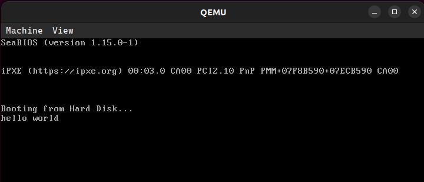

# Real mode vs protected mode

Los procesadores x86 mantienen compatibilidad con sus antecesores y para agregar nuevas funcionalidades deben ir “evolucionando” en el tiempo durante el proceso de arranque. Todos los CPUs x86 comienzan en modo real en el momento de carga (boot time) para asegurar compatibilidad hacia atrás (Backward compatibility), en cuanto se los energiza se comportan  de manera muy primitiva, luego mediante comandos se los hace evolucionar hasta poder obtener la máxima cantidad de prestaciones posibles.
El ***modo protegido*** es un modo operacional de los CPUs compatibles x86 de la serie 80286 y posteriores. Este modo es el primer salto evolutivo de los x86. El modo protegido tiene un número de nuevas características diseñadas para mejorar la multitarea y la estabilidad del sistema, tales como la protección de memoria, y soporte de hardware para memoria virtual como también la conmutación de tareas.

  

## UEFI & Coreboot
- ¿Qué es la ***UEFI***? ¿Cómo se puede usar?
    - UEFI (Interfaz de Firmware Extensible Unificada) es un estándar de firmware que ha reemplazado en gran medida al antiguo BIOS (Sistema Básico de Entrada/Salida) en las computadoras modernas. Con respecto al tradicional BIOS, UEFI ofrece una serie de ventajas, como:
        - La BIOS usaba MBR, que estaba limitado a entradas de 32 bits y se limitaba a 4 particiones físicas en total. UEFI usa GPT que usa entradas de 64 bits, que se traduce en que cada una puede tener un máximo de 2 TB de capacidad. 
        - Soporte para arranque seguro (Secure Boot), que ayuda a prevenir la ejecución de malware durante el proceso de arranque.
        - Velocidad de arranque acelerada. En UEFI los módulos y controladores se cargan en paralelo, mientras que en BIOS se cargan secuencialmente. 
        - Soporte para interfaces gráficas. 

    - Para acceder a la UEFI se debe verificar cuál tecla ha sido asignada a nuestro sistema para entrar a modo UEFI, y presionarla durante el proceso de ***Power On Self Test*** previo al inicio del sistema operativo.

- Estas son algunas de las funciones de la UEFI a la que se podría llamar.

|     |   |      |      |     |    |      |    |   |      |
|------|------|------|------|------|-----|--------|--------|--------|--------|
| alias    | attrib  | bcfg     | cd     | cls    | comp   | cp     | date   | dblk   | dh     |
| dmpstore | echo    | edd30    | edddebug | edit  | err    | guid   | help   | load   | ls     |
| map      | mem     | memmap   | mkdir  | mm     | mode   | mount  | pause  | pci    | reset  |
| rm       | set     | stall    | time   | type   | unload | ver    | vol    |        |        |

Estos comandos estan relacionados al booteo desde una partición particular, otros relacionados a la obtención y modificación de información de las particiones, otros para manejar dispositivos y drivers, y muchas otras funcionalidades.  

- Vulnerabilidades de UEFI que puedan ser explotados.
   
ESET informó a Lenovo sobre todas las vulnerabilidades descubiertas el 11 de octubre de 2021. Se asignaron las siguientes CVE:
 * CVE-2021-3970: Lectura/escritura arbitraria de SMM.
    * CVE-2021-3971: Afecta a drivers de firmware para UEFI.
    * CVE-2021-3972: Permite modificar la configuración de arranque seguro.

El atacante puede desplegar y ejecutar con éxito implantes en flash SPI o ESP en los dispositivos afectado

- ¿Qué es el ***Converged Security and Management Engine*** *(CSME)*?

El ***Converged Security and Management Engine*** (CSME) de Intel es un controlador de seguridad y administración basado en hardware que está aislado de la CPU (Unidad Central de Procesamiento). CSME de Intel es la raíz de confianza del sistema para los componentes de Intel (y opcionalmente para un fabricante de equipos originales (OEM) si decide usarlo). CSME está compuesto por una extensión de hardware de administración convergente y un motor de seguridad convergente.
Se pueden encontrar más detalles en el whitepaper de Intel sobre el CSME [aquí](https://www.intel.com/content/dam/www/public/us/en/security-advisory/documents/intel-csme-security-white-paper.pdf).

- ¿Qué es la ***Intel Management Engine BIOS Extension*** *(Intel MEBx)*?
    - La MEBx es la predecesora del CSME. Su propósito era el mismo, pero es una versión más antigua y con menos funcionalidades.

  

 

- ¿Qué es el ***coreboot***?

   Coreboot, anteriormente conocido como LinuxBIOS, es un proyecto de software destinado a reemplazar el firmware propietario (BIOS o UEFI) que se encuentra en la mayoría de los ordenadores con un firmware ligero diseñado para realizar sólo el número mínimo de tareas necesarias para cargar y ejecutar un sistema operativo moderno de 32 o 64 bits. Coreboot es respaldado por la Free Software Foundation (FSF). Coreboot se puede encontrar en [GitHub](https://github.com/coreboot/coreboot).

- ¿Qué productos incorporan el coreboot?

  - Protectli: Viene con el firmware Dasharo, mantenido por 3mdeb. Soporta numerosos sistemas operativos populares como distribuciones Linux, FreeBSD y Windows, incluyendo Debian, Ubuntu, OPNsense, pfSense, ProxMox VE, VMware ESXi, Windows 10 y 11, entre otros.
  - NovaCustom: Portátiles configurables con firmware basado en coreboot Dasharo, mantenido por 3mdeb. Ofrece compatibilidad total con GNU/Linux y Windows. Garantiza actualizaciones de seguridad a través de fwupd durante cinco años, y cuenta con características de seguridad importantes como arranque medido, arranque verificado, integración TPM y Arranque Seguro UEFI.

  - Dispositivos Chrome OS de Google: Incluyen OnHub y la tableta Pixel C, ambos con coreboot.

  - Minifree Ltd: Ofrece hardware preinstalado con la distribución Libreboot de coreboot.

  - Technoethical: Basados en la UE y EE. UU., envían a todo el mundo equipos con la distribución Libreboot de coreboot.
  - Purism: Fabrica portátiles enfocados en seguridad diseñados para trabajar con software libre y de código abierto. Son los únicos portátiles de alto rendimiento en el mercado específicamente diseñados para emparejar tecnologías recientes con coreboot y un Intel Management Engine neutralizado.

  - Star Labs: Ofrece una gama de portátiles diseñados y construidos específicamente para Linux con firmware coreboot. Utilizan Tianocore como carga útil e incluyen una opción de NVRAM para desactivar el Intel Management Engine.

- Las ventajas de utilizar Coreboot incluyen:

***Libertad y Transparencia*** : Coreboot es completamente de código abierto, lo que significa que se puede examinar, modificar y distribuir el código según tus necesidades.

***Arranque Rápido***: Coreboot está diseñado para un inicio rápido y eficiente del sistema, al ser un firmware ligero y minimalista.

***Compatibilidad con Hardware Variado***: Coreboot es compatible con una variedad de plataformas y arquitecturas, lo que lo convierte en una opción versátil para una amplia gama de hardware.

***Seguridad y Privacidad***: Coreboot ofrece una mayor seguridad y privacidad en comparación con los firmwares propietarios, ya que se puede auditar y verificar el código fuente.

***Modo de 32 bits***: Una notable característica única de coreboot es que la versión x86 corre en modo de 32 bits después de ejecutar solamente dieciséis instrucciones (casi todos los otros BIOS de x86 corren exclusivamente en modo de 16 bits)

## Linker
- ¿Qué es y qué hace un ***linker***?
    - El linker es un programa que toma uno o varios ficheros de tipo *objeto* (`.o`, `.obj`) generados a partir de un compilador y los combina en un único archivo ejecutable en forma binaria que englobará las instrucciones que debe ejecutar el procesador.
- ¿Qué es la dirección que aparece en el script del linker?
    - La dirección de memoria `0x7c00` indica una posición de memoria absoluta a partir de la cual se buscarán 512 bytes —correspondientes al Master Boot Record (MBR)—, especificando las instrucciones de arranque del sistema operativo y la tabla de particiones del dispositivo de almacenamiento.
- ¿Por qué es necesaria esta dirección?

 Esta dirección de memoria proviene de la primera generación de chips 8088 de Intel. Para mantener compatibilidad, los CPUs subsiguientes han mantenido la utilización de esta dirección para cargar el MBR.
    
Cuando se utilizaban estos chips, el sistema operativo era 86-DOS. Este OS necesitaba un mínimo de 32KB de memoria, lo cual representamos en el rango hexadecimal `0x0000 — 0x7fff`.

El chip 8088 ocupa desde `0x0000` hasta `0x03ff` para almacenar handlers de interrupciones, por lo que el rango de memoria utilizable que resta es `0x0400 — 0x7fff`.

Para dejar al OS la mayor cantidad de memoria contigua para utilizar, se decidió poner al MBR tan "alejado" como se pueda. Para esto, sabiendo que el MBR ocupa 512 bytes (`0x200`) y que se necesitan 512 bytes adicionales para información generada por el MBR, se eligió la posición del MBR 1024 bytes antes del límite de memoria. De esta forma: `0x7fff - 0x200 - 0x200 + 1 = 0x7c00`.

  

 
  

  

  

 
 
 

  

  

 
- Compare la salida de `objdump` con `hd` y verifique dónde fue colocado el programa dentro de la imagen.

- Primero, vemos el output del comando `hd`:\
 

  

   

- Ahora, el output del comando `objdump`:\
 

  

   

    - Analizando línea a línea, podemos observar que el programa en la imagen esta cargado desde la posición `0x00000000` en los bytes correspondientes al MBR.

 
- ¿Para qué se utiliza la opción `--oformat binary` en el linker?
    - La opción `--oformat` se utiliza para especificar el formato del archivo objeto resultante. En este caso, especificamos que luego del linking, el archivo generado será un archivo binario.

## Protected mode